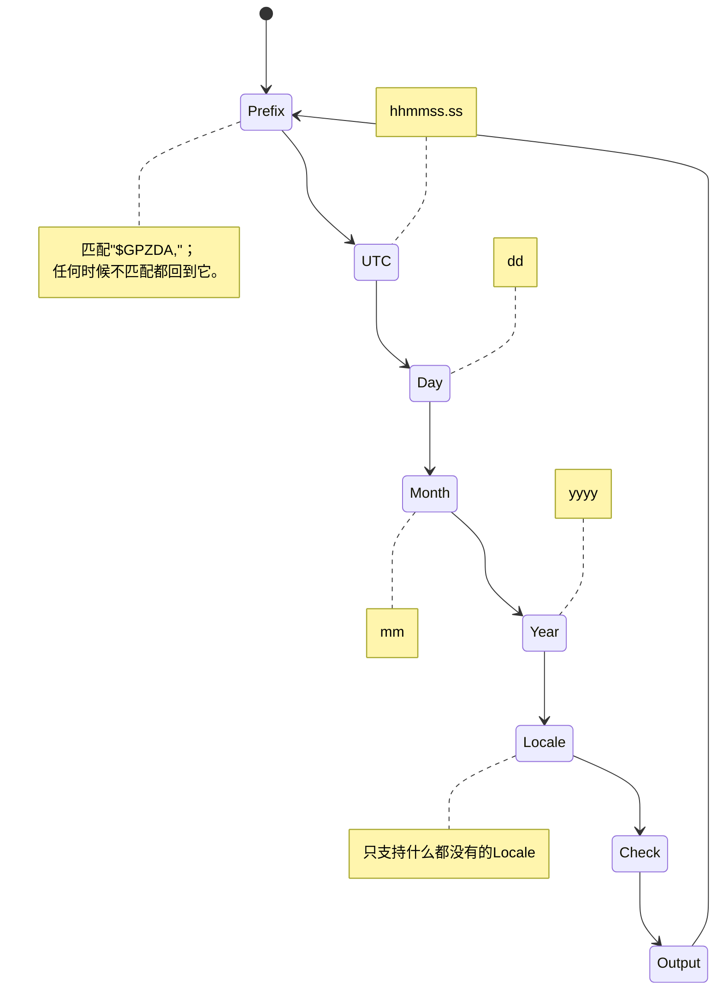
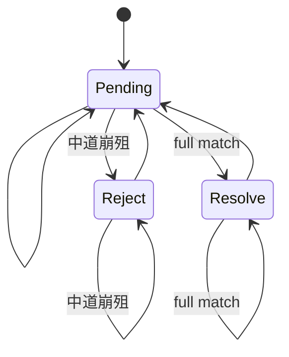
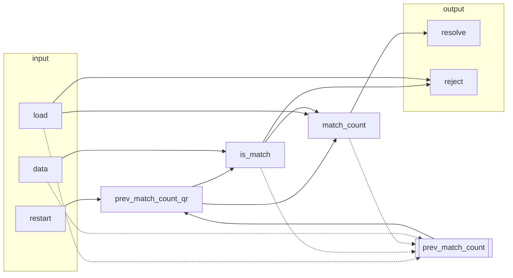

# GPZDA

提取[GPZDA](https://docs.novatel.com/OEM7/Content/Logs/GPZDA.htm)格式的GPS信息。

```
$GPZDA,hhmmss.ss,dd,mm,yyyy,,*hh
```

> 注释里的“轮”指clock。

## `GpsReceiver`



## `Comparer`

这是异步的，匹配完成后的下一clock才有反馈。



### `ComparerSync`

类似`Comparer`，但匹配完成的那一个clock就会反馈。

不是FSM，要不然做不到即时。



> 双线框代表`reg`，单线框代表`wire`；实线代表`=`，虚线代表`=>`。

