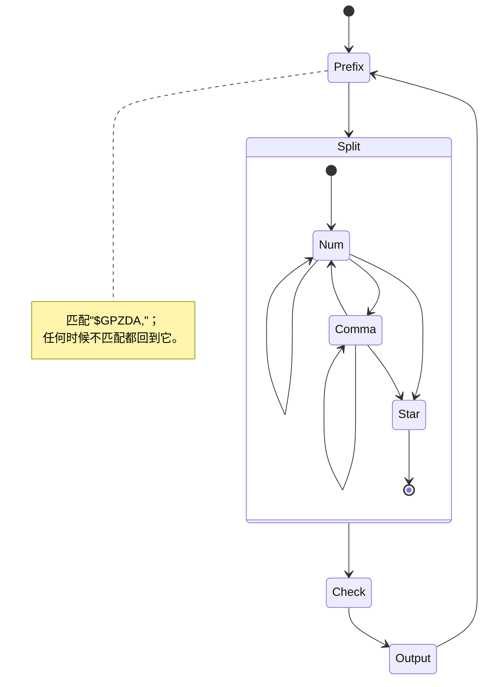
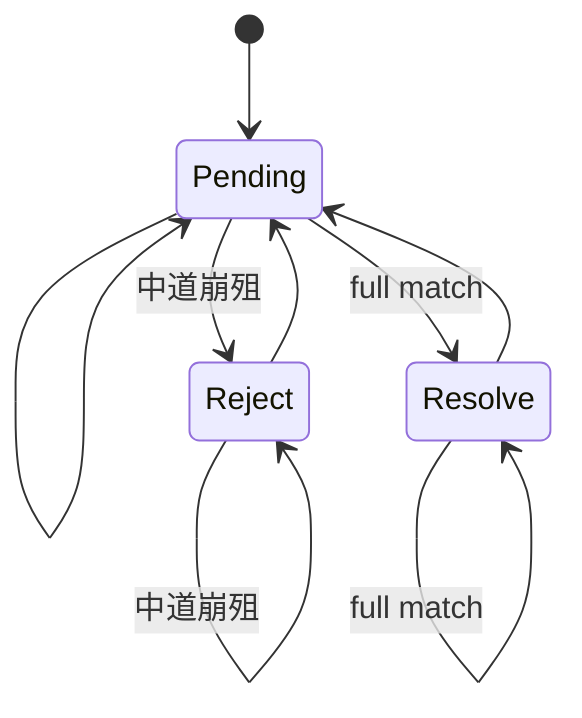

# GPZDA

提取[GPZDA](https://docs.novatel.com/OEM7/Content/Logs/GPZDA.htm)格式的GPS信息。

```
$GPZDA,hhmmss.ss,dd,mm,yyyy,,*hh
```

## `GpsReceiver`


```mermaid
stateDiagram-v2
    [*] --> Prefix
    note right of Prefix: 匹配"$GPZDA,"；<br>任何时候不匹配都回到它。
    
    Prefix --> Split
    state Split {
        [*] --> Num
        Num --> Num
        Num --> Comma
        Comma --> Num
        Comma --> Comma

        Num --> Star
        Comma --> Star
        Star --> [*]
    }
    Split --> Check
    Check --> Output
    Output --> Prefix
```

## `Comparer`


```mermaid
stateDiagram-v2
    [*] --> Pending
    
    Pending --> Pending
    Pending --> Reject : 中道崩殂
    Pending --> Resolve : full match
    
    Reject --> Pending
    Reject --> Reject : 中道崩殂
    Resolve --> Pending
    Resolve --> Resolve : full match
```

